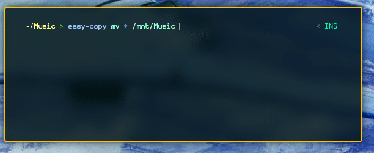

[](https://aur.archlinux.org/packages/easy-copy/)
[](https://github.com/scrouthtv/easy-copy/releases/)

# easy-copy
Aims to provide a user-friendly &amp; fast alternative to cp, mv and rf.



## Warning
This project is currently under development.
Use it at your own risk. I take zero responsibility for any damage linked to this program in any way.

## Features
 - See progress, speed and remaining time during I/O.
 - Recurse into directories without having to add an extra flag.
 - All extra features happens asynchronous so easy-copy is as fast as alternatives.

## Installation

For Arch Linux users, there's an [AUR package](https://aur.archlinux.org/packages/easy-copy/). 

On other OSs:
1. clone the repository
```bash
 ~ git clone https://github.com/scrouthtv/easy-copy
 ~ cd easy-copy
```
2. build using go
```bash
 ~ go build .
```
For more details, see [INSTALL](/INSTALL).

## Contributing
 - Get help with *EasyCopy* by opening an issue on the project's page.
 - Feel free to fork *EasyCopy* and open PRs with new features.

# Copyright
Copyright &#169; 2021 The *EasyCopy* authors.
This software is licensed under GNU GPL v3.0.
This means that you are free to change and redistribute *EasyCopy* as a whole or any part of it, as long as the source to any derived work is as well publicly disclosed and licensed under GNU GPL v3.0.
Absolutely no warranty is provided for this software.
For more information read the LICENSE file that is distributed with *EasyCopy*.
